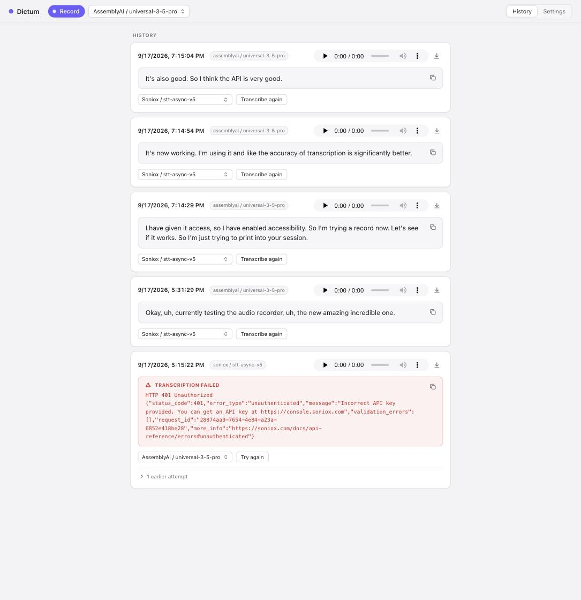
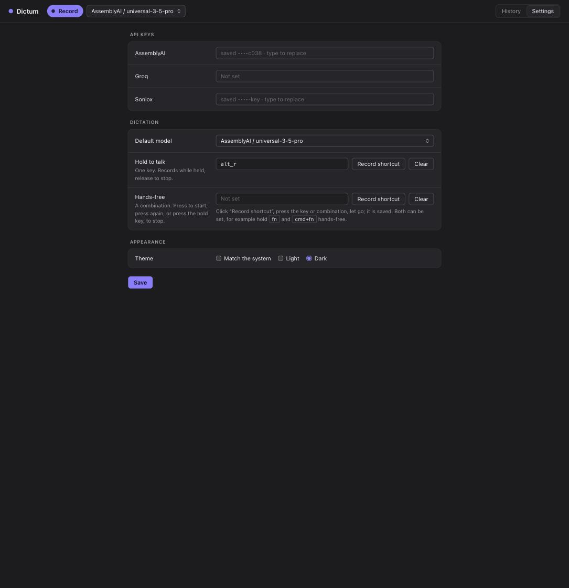

# Dictum

**Dictate with the speech-to-text engine you choose, on your own API keys.**


Dictum is a small, local dictation app. Hold a key or press a shortcut,
speak, and the transcript is pasted where you were typing. You bring your
own API key for a speech-to-text provider, AssemblyAI, Groq or Soniox, or
download a model that runs on your own Mac, so you pick the engine that
transcribes you instead of taking whichever one a dictation product bundles.
Every recording and transcript is kept in a local history, with the
provider's exact error and a one-click retry with another model when a
transcription fails, and a performance table by model built from your own
use.

It is for people who dictate a meaningful share of what they write and want
control over the engine, the cost and where their words go.

<p align="center">
  
  
</p>

<!-- TODO: a short recording of hold the key, speak, release, watch the paste land -->

## Install

Requires Python 3.12 or newer. With [uv](https://docs.astral.sh/uv/):

```sh
uvx dictum
```

or, from a checkout:

```sh
uv run dictum
```

On macOS this opens Dictum's window (history, dictionary, settings) and
puts a microphone icon in the menu bar; closing the window leaves it running
there. Elsewhere, or with `--no-menu`, it is the page alone, opened in your
browser at `http://localhost:4187`. The page's own Record button, the
history, retry and the dictionary work wherever Python runs; the global
shortcut and the automatic paste need the macOS menu-bar app for now.
`dictum --help` lists `--port`, `--data DIR`, `--no-open` and `--no-menu`.

## Permissions (macOS)

The first time you set a shortcut, macOS asks for three permissions in
**System Settings › Privacy & Security**:

| Permission | Why Dictum needs it |
|---|---|
| Microphone | to record the clip |
| Input Monitoring | to see the shortcut while another app has focus |
| Accessibility | to paste the transcript into that app |

With `uvx dictum` they are granted to whatever runs it, your terminal or
Python, and asked again if that changes. Building `Dictum.app` (below) gives
macOS a stable app to attach them to.

The order matters. Input Monitoring comes first: until it is granted Dictum
cannot see the shortcut, so it never records and never asks for the
microphone. A shortcut that uses fn also needs Accessibility before it
listens, because owning that key takes an active event tap; Dictum asks.
Grant them, quit Dictum from the menu bar and open it again, then
hold the shortcut: the Microphone prompt appears on that first recording.
There is no way to add an app to the Microphone list by hand.

## Dictating

Set a shortcut once in Settings; Dictum opens there on first run. Click
"Record shortcut", press the key or combination, let go. Two kinds, and both
can be set:

- **Hold to talk**: one key, for example `fn` or the right Option key.
  Record while held, release to stop.
- **Hands-free**: a combination, for example `cmd+fn`. Press to start;
  press again, or press the hold key, to stop.

While you record, a small "Recording" pill sits in the bottom-left corner
of the screen your pointer is on; it says "Transcribing…" until the text
lands, and never takes focus. On stop, the clip is saved to history at once
and goes to your default model; the transcript is copied to the clipboard
and pasted into whatever had focus. Two dictations in a row land in the
order you spoke them. A failure shows as a notification with the provider's
message; History has the retry.

The default model is the picker next to the Record button, the same one as
in Settings; picking a model applies at once, no Save. The Record button in
the window records the same WAV the shortcut does, so every model, cloud or
local, takes it.

**Fast mode** (Settings, off by default) uploads the audio while you record,
so a dictation over two minutes is transcribed as soon as you stop instead of
after the whole file has gone up. AssemblyAI only, since only its long-form
endpoint takes an upload; shorter clips use the sync endpoint as before and
are unchanged.

**Performance.** Every transcription records how long the clip was, how long
the provider took, and whether fast mode was used. History shows the table
by model: runs, minutes of audio, median wait, and speed as seconds of audio
per second waited. Measured on 2026-09-18 with a 172-second dictation over
AssemblyAI Universal-3.5 Pro: 7.0 s with fast mode, 14.8 s without, of which
the upload alone was 6 to 7 s. Your own table is the one to trust.

When `fn` is one of your shortcuts, Dictum owns that key while it runs: a
tap no longer opens Emoji & Symbols or Apple's dictation, and fn does not
reach other apps as a modifier. Pick another key if you need fn elsewhere.

## Providers and cost

| Provider | Model | How |
|---|---|---|
| AssemblyAI | universal-3-5-pro | sync endpoint; clips over two minutes use the long-form endpoint |
| Groq | whisper-large-v3-turbo | OpenAI-style transcriptions endpoint |
| Soniox | stt-async-v5 | upload, poll, fetch; the upload is deleted afterwards |
| Local | Whisper large-v3-turbo, its compact build, small.en, base.en | whisper.cpp on this machine; no key, nothing leaves the Mac |
| Parakeet (local) | parakeet-tdt-0.6b-v3 | NVIDIA's Parakeet on MLX, Apple Silicon only; engine installed once from a terminal |

Enter a provider's API key in Settings and its model appears in the model
list; pick one as the default. You pay each provider directly, per minute
of audio, at its own published rate:
[AssemblyAI](https://www.assemblyai.com/pricing),
[Groq](https://groq.com/pricing),
[Soniox](https://soniox.com/pricing).

Keys live in the local database, are only ever sent to the provider they
belong to, and are never shown again beyond a masked hint.

**Local models** need no key. Settings lists them with their size and a
Download button; a model is fetched once (resumes if interrupted) and then
sits in the same model lists as the cloud ones, so you can make it the
default or retry a cloud failure with it. Runs on the GPU on Apple Silicon.
A local model takes memory only while it is the selected model: it is loaded
when you pick it, freed when you pick something else, and a model used for a
single retry is freed right after.
Measured on 2026-09-18 on an M5: base.en transcribes 25 s of speech in
under a second. Your dictionary terms are passed as the prompt.

**Parakeet** was the most accurate offline model in our tests, but its
engine (Apple's MLX and the `parakeet-mlx` package, about 480 MB, Apple
Silicon only) is not bundled, so the app stays small for everyone who does
not want it. Install the engine once, from a terminal:

```sh
uv tool install parakeet-mlx
```

Dictum finds it on its own, and Parakeet appears under Local models with
the same Download and Remove buttons; the weights are 2.5 GB. The model
runs in a helper process inside that installation, loaded once.

## History

Every recording and every transcription attempt is kept: the audio is
playable and downloadable, the transcript copies with a click, and any
recording can be transcribed again with another model. Failures show the
provider's response verbatim.

## Personal dictionary

The Dictionary tab holds **terms** the provider should expect (names,
products, identifiers), sent along with every clip, and **replacements**
(heard → meant) applied to every transcript. Edit it by hand, or click
**Build from history** to have a language model of your choice, Anthropic
or OpenAI on your own key, read your recent transcripts and propose
additions, which you review before anything is saved. Entries you add or
pin are never changed by the model. If you dictate to AI agents, they can
post corrections once you have confirmed a mistranscription with them.
The suggested models, Claude Fable 5.1 and GPT-6 Astra, are the current
strongest from each provider; any model id the provider accepts works.

Details: [the dictionary file](docs/dictionary.md) and
[the agents' API](docs/agents-api.md).

## Dictum.app

A plain `dictum` process shows up as "python3" in the menu bar, the Dock
and the permission prompts. To have it be Dictum, with its icon, build the
standalone app once and install it (macOS only):

```sh
uv sync --group build
uv run --group build python packaging/build_app.py     # writes dist/Dictum.app
uv run dictum install-app --from dist/Dictum.app        # copies it to /Applications
```

Open it from Applications and grant the three permissions once to
"Dictum". It shares the data and settings of `dictum`. There is also a
lighter `dictum install-app` without `--from`, a launcher bundle that runs
this installation; macOS may refuse to list it in the permission panels,
so prefer the standalone one. See [packaging](docs/packaging.md).

## Data and privacy

Recordings, transcripts, settings and keys live in a local SQLite database
and files at `~/Library/Application Support/dictum` on macOS or
`~/.local/share/dictum` elsewhere, or wherever `DICTUM_DATA` or `--data`
points. Nothing leaves your machine except:

- the audio clip, sent to the speech-to-text provider you picked for that
  recording;
- when you click "Build from history", your recent transcripts, sent to the
  language-model provider you chose in Settings.

No telemetry, no accounts, no cloud storage.

## Development

```sh
uv sync                 # environment with dev tools
uv run pytest           # tests
uv run ruff check .     # lint
uv run ruff format .    # format
uv run mypy             # types, strict
```

Pull requests go into `develop`; `main` moves by a release pull request
after a review of everything on `develop`. See
[CONTRIBUTING.md](CONTRIBUTING.md), [architecture](docs/architecture.md),
[adding a provider](docs/providers.md) and, for where the work stands,
[the handoff](docs/handoff.md).

## Licence

MIT. See `LICENSE`.
