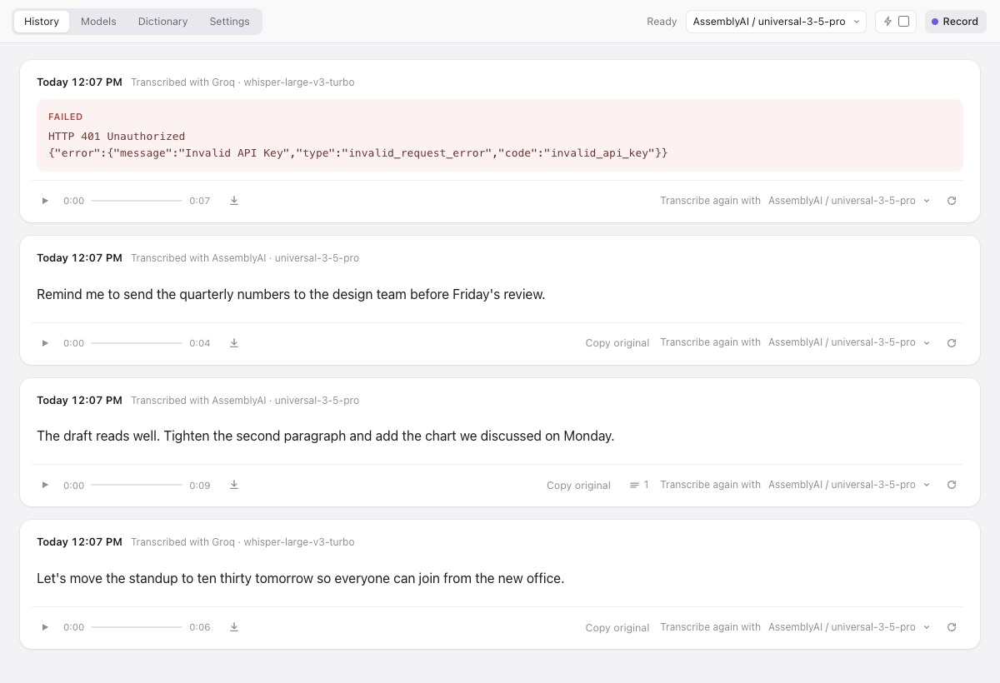
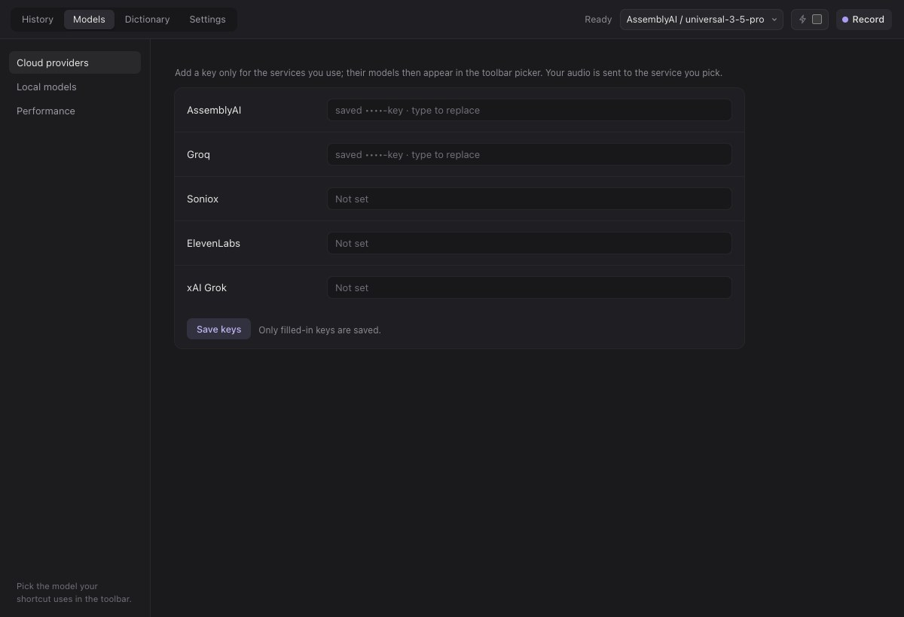

<h1>
  <picture>
    <source media="(prefers-color-scheme: dark)" srcset="docs/brand/entune-logo-dark.svg" />
    
  </picture>
</h1>

**Dictate with the speech-to-text engine you choose, on your own API keys.**


Entune is a small, local dictation app. Hold a key or press a shortcut,
speak, and the transcript is pasted where you were typing. You bring your
own API key for a speech-to-text provider, AssemblyAI, Groq, Soniox,
ElevenLabs or xAI, or download a model that runs on your own Mac, so you
pick the engine that transcribes you instead of taking whichever one a
dictation product bundles.
Every recording and transcript is kept in a local history, with the
provider's exact error and a one-click retry with another model when a
transcription fails, and a performance table by model built from your own
use.

It is for people who dictate a meaningful share of what they write and want
control over the engine, the cost and where their words go.

<p align="center">
  
  
</p>

<!-- TODO: a short recording of hold the key, speak, release, watch the paste land -->

## Install

Requires Python 3.12 or newer. With [uv](https://docs.astral.sh/uv/):

```sh
uvx entune
```

or, from a checkout:

```sh
uv run entune
```

On macOS this opens Entune's window (history, dictionary, settings) and
puts a microphone icon in the menu bar; closing the window leaves it running
there. Elsewhere, or with `--no-menu`, it is the page alone, opened in your
browser at `http://localhost:4187`. The page provides recording, history, retry
and dictionary controls. Native
shortcuts, paste, the recording indicator and permission setup are implemented
for macOS only. Windows and Linux browser-mode installation and audio/provider
availability are not verified end to end; portable dependencies are not a
promise of native parity.
`entune --help` lists `--port`, `--data DIR`, `--no-open` and `--no-menu`.

## Permissions (macOS)

On first opening the installed app, Settings guides you through the three
permissions Entune needs. Click **Allow…** beside each; macOS may send you
to **System Settings › Privacy & Security** to enable Entune:

| Permission | Why Entune needs it |
|---|---|
| Microphone | to record the clip |
| Input Monitoring | to see the shortcut while another app has focus |
| Accessibility | to paste the transcript into that app |

With `uvx entune` they are granted to whatever runs it, your terminal or
Python, and asked again if that changes. Building `Entune.app` (below) gives
macOS a stable app to attach them to.

Microphone access can be requested from setup without making a recording.
Each row updates when its permission is granted. If access was denied,
**Open Settings…** takes you to the relevant pane. If macOS asks you to quit,
reopen Entune to continue; missing permissions bring setup back on launch.
The Fn key needs Accessibility as well as Input Monitoring.

## Dictating

Set a shortcut once in Settings; Entune opens there on first run. Click
"Set…", press the key or combination, let go. Two recording shortcuts, and both
can be set:

- **Hold to talk**: one key, for example `fn` or the right Option key.
  Record while held, release to stop.
- **Hands-free**: a combination, for example `cmd+fn`. Press to start;
  press again, or press the hold key, to stop (on release if that key is also part of Cancel).

**Cancel:** press `fn+ctrl` during recording, transcription, processing, or pending
delivery. Cancellation saves usable captured audio for later transcription and prevents
pasting. A tap shorter than 0.25 seconds contains no usable capture and is not saved.
Synchronous speech calls may need to drain; the app remains busy until they release
resources. Existing Fn+Escape cancellation settings use Fn+Control on load because
Escape can cancel foreground work. Custom shortcuts remain configurable; a modifier
combination is not universally conflict-free across all applications.

The non-activating pill displays the actual stage: recording, saving, transcribing,
contextual correction, filler reduction, formatting, or delivery. Disabled stages are
skipped. One dictation owns the app until delivery completes; a new one must wait.
Learning owns the same guard through proposal review. The final text is copied once
and pasted into the **current editable input**, including in a different app from where
recording began. With no editable target, Entune reports “Copied to clipboard — no
active text field.” If a paste cannot be verified through Accessibility, completion
says so. Completion also appears in the pill, so it does not depend on notification
permissions. History retains audio and all attempts for retry.

The default model is the picker next to the Record button, the same one as
in Settings; picking a model applies at once, no Save. The Record button in
the window records the same WAV the shortcut does, so every model, cloud or
local, takes it.
The speech model is sampled when transcription starts, so changing it while speaking
changes the engine for that recording. Changes after transcription starts apply to
later attempts. Enhancement switches are sampled after speech succeeds. In fast mode,
audio already uploaded while recording went to the provider selected at recording
start. Switching providers does not retract that upload; when transcription starts,
the old upload is aborted and the saved clip goes to the then-selected provider.

**Fast mode** (Settings, off by default) uploads the audio while you record,
so a dictation over two minutes is transcribed as soon as you stop instead of
after the whole file has gone up. AssemblyAI only, since only its long-form
endpoint takes an upload; shorter clips use the sync endpoint as before and
are unchanged.

**Performance.** Every transcription records how long the clip was, how long
the provider took, and whether fast mode was used. The chart button next
to the model picker opens the table by model and mode. **Speed** is the transcription
wait for one minute of audio, from successful runs whose length and wait were both
measured (it covers the speech step, not later processing). **Corrections** counts
dictionary replacements per 100 words in dictations where the dictionary step ran; it
reflects the confusions the dictionary knows, not overall accuracy. **Used** combines the
number of runs, failures and total audio. Measured on 2026-09-18 with a 172-second dictation over
AssemblyAI Universal-3.5 Pro: 7.0 s with fast mode, 14.8 s without, of which
the upload alone was 6 to 7 s. Your own table is the one to trust.

When `fn` is one of your shortcuts, Entune owns that key while it runs: a
tap no longer opens Emoji & Symbols or Apple's dictation, and fn does not
reach other apps as a modifier. Pick another key if you need fn elsewhere.

## Providers and cost

| Provider | Model | How |
|---|---|---|
| AssemblyAI | universal-3-5-pro | sync endpoint; clips over two minutes use the long-form endpoint |
| Groq | whisper-large-v3-turbo | OpenAI-style transcriptions endpoint |
| Soniox | stt-async-v5 | upload, poll, fetch; the upload is deleted afterwards |
| ElevenLabs | scribe_v2 | synchronous speech-to-text endpoint |
| xAI Grok | grok-voice-transcribe-2.0 | synchronous speech-to-text endpoint |
| Whisper.cpp (local) | Whisper large-v3-turbo, its compact build, small.en, base.en | speech recognition on this machine; no speech API key |
| Parakeet (local) | parakeet-tdt-0.6b-v3 | NVIDIA's Parakeet on MLX, Apple Silicon only; engine installed once from a terminal |

Enter a provider's API key on the Models page and its model appears in the
model list; pick one as the default. You pay each provider directly, per minute
of audio, at its own published rate:
[AssemblyAI](https://www.assemblyai.com/pricing),
[Groq](https://groq.com/pricing),
[Soniox](https://soniox.com/pricing),
[ElevenLabs](https://elevenlabs.io/pricing/api),
[xAI](https://docs.x.ai/developers/models).

Keys live in the local database, are only ever sent to the provider they
belong to, and are never shown again beyond a masked hint.

**Local models** need no key. The Models page lists them with their size and a
Download button; a model is fetched once (resumes if interrupted) and then
sits in the same model lists as the cloud ones, so you can make it the
default or retry a cloud failure with it. Runs on the GPU on Apple Silicon.
A local model takes memory only while it is the selected model: it is loaded
when you pick it, freed when you pick something else, and a model used for a
single retry is freed right after.
Measured on 2026-09-18 on an M5: base.en transcribes 25 s of speech in
under a second.

**Parakeet** was the most accurate offline model in our tests, but its
engine (Apple's MLX and the `parakeet-mlx` package, about 480 MB, Apple
Silicon only) is not bundled, so the app stays small for everyone who does
not want it. Install the engine once, from a terminal:

```sh
uv tool install parakeet-mlx
```

Entune finds it on its own, and Parakeet appears under Local models with
the same Download and Remove buttons; the weights are 2.5 GB. The model
runs in a helper process inside that installation, loaded once.

## History

Every recording and every transcription attempt is kept: the audio is
playable and downloadable, the transcript copies with a click, and any
recording can be transcribed again with another model. Failures show the
provider's response verbatim.

## Personal dictionary

Speech models mishear names, products and everyday words. The Dictionary tab groups
recognized forms with their possible meanings, definitions and exact output spellings.
Explicit associations decide which meanings can compete for a form; context decides
which one applies. Edit entries directly, or ask the configured language model to
suggest them: **Suggest new entries** (generation) reads this speech model's raw
history and only adds; **Suggest improvements** (refinement) compares each raw
transcript with what the dictionary step made of it and can add, revise or remove
learned entries. **How the dictionary works** opens a short guide.
Additions, before/after updates, and explicit removals start included. Edit them, dismiss unwanted proposals with ×,
then apply the remainder once. Dismissing a proposal does not delete active knowledge.

Learned associations stay specific to the speech model. Pinning shares and protects a
meaning and its associations across models, without giving it priority over competitors.
Existing dictionaries are backed up before conversion and retained for review. Confirmed
agent corrections still use the existing local API. The dictionary model is chosen on
the Dictionary page and serves every learning run; keys are added in Settings.
The dictionary model can come from Anthropic, OpenAI, Google Gemini, Groq or Mistral;
Groq uses the same key as Groq speech. Generation suggestions are Sonnet 5 and GPT-5.4
mini. **Add an entry** creates a group by
hand: meanings with output spellings and definitions, recognized forms, and which
meanings each form may stand for.

**Learn from audio**, in the Dictionary tab, opens a dialog. Choose Entune recordings,
or import audio from Wispr Flow on this Mac (including its local backups) or from an
audio folder; imports keep their recording date where the source has one. Other
applications' transcripts are ignored. Entune keeps a local copy of each distinct
audio file in `dictionary-audio/`, separate from recording history, and can reuse
it when you select another speech model. WAV, MP3, M4A, FLAC, OGG and WebM files
up to 199 MB can be uploaded; the chosen provider must support the audio format
and length. A build uses the speech and dictionary models selected when it starts.
A two-handle range over recorded time, oldest to newest without the gaps between days,
selects a continuous stretch of whole recordings: all audio by default, the most recent
by dragging the left handle. The exact duration, count and edge dates are shown, and
the included recordings can be listed and played. Fresh transcripts stay in memory within the workflow and never become
history attempts. Retry reuses successful transcriptions, including after a later
generation failure. Finishing, discarding, replacing the workflow, or closing Entune
clears that temporary text. Source audio is kept.

History and audio share one exclusive, user-initiated learning workflow. Finish an
active dictation first. Learning blocks dictation and separate dictionary editing,
including while proposals await review. Stop or a later failure retains validated
completed batches for review, with their actual coverage and cause. A running speech
call may need to finish; a generation request can be interrupted. Apply, discard, or
retry the completed portion. No changes are applied automatically.

The dictionary model's reply must match the dictionary's format, which the provider
enforces where it can. When a reply still breaks one of the dictionary's rules, the
model is shown the rule and asked for a corrected reply, at most twice per part. The
progress line says so and names the rule, and **Stop** ends it. Failed requests,
refused keys and replies cut at the output limit are never retried.

Default history refinement uses up to 300 recent, unprocessed attempts for the selected
speech model; “All history” deliberately includes older/previously examined data.
Refinement pairs each raw transcript with the dictionary step's recorded result and
decisions, which show what the system did, not confirmed intended wording. Filler
reduction, formatting and the delivered text are never sent. Older attempts without a
recorded result, and freshly transcribed audio, are sent as raw text only. Applying at least one actual change marks only fully
covered input IDs learned for that model. Applying none leaves them eligible. A
partially processed transcript remains eligible. New dictations after selection and
other models' boundaries are unaffected. Pinned definitions can be reviewed and updated;
the agent cannot delete pinned meanings or remove any existing pinned variant.


### Jev decides each match in context

With a [TypeSafe](https://typesafe.ai) key and contextual correction enabled, **Jev**
classifies eligible meanings from the words around each occurrence. Jev generates no replacement
text: Entune applies the selected stored spelling. A literal Jeff or GIF is a meaning in
its own right. Every valid response selects the highest-scoring eligible meaning, even
when scores are close. Exact ties use Jev's declared tied winner. Invalid responses
fail the stage; scores are never invented or pooled by output spelling.

Only explicitly approved, unambiguous direct mappings bypass classification. Pinning or
having a single recorded candidate is not enough. Turning contextual correction off
disables the entire dictionary stage. The previous binary classifier's cached accuracy and timings
are documented separately; they do not establish the new classifier's quality or latency.
History and Settings report work performed, including direct changes and abstentions,
rather than an accuracy score. Optional formatting inserts paragraph breaks and bullets,
including the first list item, while retaining existing structure and words. Lines without
sentence punctuation stay whole; a single unpunctuated note needs no formatting request.

**Reduce repeated fillers** is a separate opt-in. Code proposes adjacent repeats of
English `um`, `uh`, `erm` or `like`; Jev classifies hesitation versus meaningful speech.
Only confidently classified hesitation runs are reduced to one occurrence. Quoted/code
spans are excluded, and uncertain answers preserve the words. History shows the exact
deletions and timing separately from dictionary replacements. This initial policy has
offline/mocked coverage; its live classification quality has not been evaluated.

Successful speech and its original text are saved before correction. If
contextual correction fails, Entune delivers the untouched original and
shows a noninterrupting notice, skipping cleanup and formatting. Those later stages run
in that order; final failure stops all remaining stages, retains the last completed
text and explains which stage failed and which later stages were skipped. Every completed
stage output and occurrence-selection provenance is saved internally. History shows
only the final result for each attempt; canceled attempts show an audio-saved notice.
Settings > Providers controls the processing wait: initially five seconds
total across correction, cleanup and formatting, three per attempt, and at most two
attempts per request. Each applicable stage sends one request before retries. Transient
failures can retry within that shared deadline. Explicit exhausted-credit, authentication
and authorization errors return immediately, including explicit credit failures in HTTP 429.
These are configurable defaults, not an accuracy or end-to-end latency guarantee. **Copy original** in history
copies the provider's text without altering history or already-pasted text. After a
correction failure, **Apply safe mappings and copy** offers a derived result using only
approved direct mappings; ambiguous spans remain untouched.

Details: [the dictionary file](docs/dictionary.md) and
[the agents' API](docs/agents-api.md).

## Entune.app

A plain `entune` process shows up as "python3" in the menu bar, the Dock
and the permission prompts. To have it be Entune, with its icon, build the
standalone app once and install it (macOS only):

```sh
uv sync --group build
uv run --group build python packaging/build_app.py     # writes dist/Entune.app
uv run entune install-app --from dist/Entune.app        # copies it to /Applications
```

Open it from Applications and grant the three permissions once to
"Entune". It shares the data and settings of `entune`. There is also a
lighter `entune install-app` without `--from`, a launcher bundle that runs
this installation; macOS may refuse to list it in the permission panels,
so prefer the standalone one. See [packaging](docs/packaging.md).

## Data and privacy

Recordings, transcripts, settings and keys live in a local SQLite database and
files. `--data` overrides `ENTUNE_DATA`; otherwise the directory is
`~/Library/Application Support/entune` on macOS, `%APPDATA%/entune` on Windows
(falling back to `~/AppData/Roaming/entune`), and `$XDG_DATA_HOME/entune` or
`~/.local/share/entune` elsewhere. Defining a data path does not establish platform support.

Enabled features determine what is sent out:

- **Cloud speech:** the selected provider receives the audio clip; AssemblyAI fast
  mode starts uploading during recording. Local Whisper.cpp and Parakeet transcribe
  on this machine, without sending audio to a speech service.
- **Dictionary builds:** the chosen dictionary model's provider receives raw source
  transcripts (for refinement, beside the dictionary step's recorded result) and the
  pinned/working confusion groups, including definitions and personal context. Each
  chunk sends the current working dictionary again.
- **Jev correction:** TypeSafe receives up to 160 characters of the original transcript
  either side of each matched occurrence, and each eligible meaning's spelling,
  definition and personal context.
  **Jev filler reduction** sends its input text and code-proposed deletion spans;
  **Jev formatting** sends the text being formatted and its sentence spans.
  Turning on any of these features sends text even when speech recognition is local.
- **Optional model downloads:** Hugging Face serves local model weights; no dictation
  audio or text is included. Parakeet's separately installed engine has its own
  package downloads. Export files are generated locally and saved through the
  browser or native Save panel.

There is no Entune account, telemetry or hosted history storage. Local speech alone
does not make every enabled feature offline. Temporary onboarding transcripts are
kept in memory for workflow retries, never stored as normal attempts, and cleared on
finish, discard, replacement or closure; this does not establish the remote providers' retention
policies. Those depend on the provider and account you use.

Saved audio and transcripts never automatically expire or get deleted, including
audio imported for dictionary builds. **Settings → Data & Privacy** exports all
original recording and imported audio as a ZIP with a file index, or all saved
transcription attempts as JSON (including raw text, models and dates). Exports are
created locally and exclude saved API keys and settings. Temporary transcripts
from imported audio are not saved or included in the transcript export.

## Development

The app uses Starlette and SQLite, plain browser JavaScript modules without
a build step, and httpx for speech-provider calls. Dictionary builds use Pydantic AI,
which gives the reply a declared schema and one interface to each language-model
provider; `learning/suggestion_model/` holds the provider list and suggested models
(`catalog.py`), the per-provider clients (`providers.py`) and the call (`call.py`),
with a custom model field in Settings.

Speech adapters are organized under providers/cloud and providers/local,
with common contracts separate from HTTP and local lifecycle capabilities.
Dictionary-generation and Jev instructions, criteria and examples live in
the packaged src/entune/prompts/ resources; thresholds and algorithms stay
in Python.

```sh
uv sync                 # environment with dev tools
uv run pytest           # tests
uv run ruff check .     # lint
uv run ruff format .    # format
uv run mypy             # types, strict
```

Pull requests go into `develop`; `main` moves by a release pull request
after a review of everything on `develop`. See
[CONTRIBUTING.md](CONTRIBUTING.md), [architecture](docs/architecture.md),
[adding a provider](docs/providers.md).

## Licence

MIT. See `LICENSE`.
